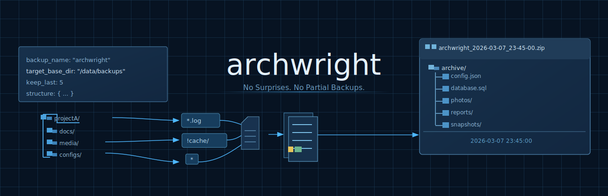

# archwright



One config. One cron. Full disaster recovery.

`archwright` backs up files, SQLite databases, and PostgreSQL databases into a single ZIP archive with rotation, restore, and service orchestration, all from one YAML config.

Built for homelabs and self-hosted stacks where Vaultwarden, Immich, Paperless-ngx, and other services need different backup steps, but you still want one tool to drive them.

## What makes this different

Most backup tools handle files and leave database dumps, service control, and restore to wrapper scripts. `archwright` keeps that flow in one config:

```yaml
backup_name: "vaultwarden"
target_base_dir: "/srv/backups/vaultwarden"
keep_last: 7

structure:
  vaultwarden:
    config:
      source_dir: "/opt/vaultwarden/data"
      include: "*.json"
    attachments:
      source_dir: "/opt/vaultwarden/data/attachments"
      include: "*"
      pre_command: "docker stop vaultwarden"
      post_command: "docker start vaultwarden"

databases:
  vaultwarden_db:
    provider: "sqlite"
    db_path: "/opt/vaultwarden/data/db.sqlite3"
```

This config snapshots the SQLite database with `sqlite3 .backup`, stops the container before copying attachments, always attempts the restart, and packages everything into a rotated ZIP archive. One cron line is enough.

## Quick start

```bash
pip install .

# Create a backup
archwright backup --config myapp.yaml

# Preview without touching anything
archwright backup --config myapp.yaml --dry-run

# Validate config and runtime prerequisites
archwright validate --config myapp.yaml

# List available archives
archwright list --config myapp.yaml

# Restore from an archive
archwright restore --config myapp.yaml --archive /srv/backups/myapp_archive.zip

# Restore only specific sections
archwright restore --config myapp.yaml --archive backup.zip --only vaultwarden/config

# Force overwrite existing files
archwright restore --config myapp.yaml --archive backup.zip --overwrite

# Module entry point
python -m backup backup --config myapp.yaml
```

## Features

**File collection**: recursive scanning with glob include/exclude patterns, brace expansion (`*.{log,txt}`), symlink-safe walking with cycle detection, and atomic archive writes via temp file plus rename.

**Database dumps**: PostgreSQL via `pg_dump` (custom format) or `docker exec pg_dump` (for containerized databases without exposed ports), SQLite via `sqlite3 .backup` (safe hot copy). Dumps run before file collection so they capture a consistent snapshot.

**Service hooks**: `pre_command` and `post_command` on file sections for stopping and restarting containers. `stop_command` and `start_command` on database sections for cold dumps. Restarts are always attempted in reverse order, and restart failures make the run fail explicitly.

**Restore**: two-phase pipeline with planning, selective restore by prefix, conflict detection, overwrite control, dry-run support, and path traversal rejection.

**Rotation**: keep the N most recent archives, delete oldest pairs (`.zip` plus `.log`). Lexicographic sort on timestamps equals chronological order.

## Safety guarantees

- `pre_command` always has a matching `post_command`; config validation rejects orphaned hooks.
- `post_command` is always attempted in a `finally` block, and a failed restart returns an error instead of reporting a false success.
- SQLite backups use `.backup`, not file copy, so live databases are copied safely.
- Archive writes use a `.zip.tmp` intermediate, so a crash never leaves a partial `.zip`.
- Restore validates path traversal; a malicious archive cannot write outside target directories.
- Config validation rejects `backup_name` with path separators or glob metacharacters.
- Memory usage is constant, with 1 MiB streamed chunks regardless of file sizes.
- Source permissions never leak into the archive; every entry is written with fixed `0644` metadata.

## Documentation

| Document | Contents |
|---|---|
| [docs/configuration.md](docs/configuration.md) | Full YAML reference: structure, databases, hooks, validation rules |
| [docs/architecture.md](docs/architecture.md) | Module map, dependency graph, data flow, error strategy |
| [docs/deployment.md](docs/deployment.md) | Cron, systemd, Ansible, monitoring, restore runbook |
| [CHANGELOG.md](CHANGELOG.md) | Version history and decision log |
| [backup/README.md](backup/README.md) | Package-level technical reference |

## License status

This repository is currently public for portfolio and evaluation purposes.
No open-source license has been granted yet, so reuse, modification, and
redistribution require explicit permission from the author.

## Running tests

```bash
pip install pytest pyyaml ruff
pytest -q
python -m ruff check backup/ tests/
pytest tests/ -m unit
pytest tests/ -m integration
pytest tests/ -m e2e
pytest tests/ -m edge
pytest tests/ -m restore
```

## Requirements

Python 3.8+ and [PyYAML](https://pypi.org/project/PyYAML/).

Optional runtime tools:
- `sqlite3` for SQLite dumps
- `pg_dump` for PostgreSQL dumps (direct connection)
- `docker` for Docker exec PostgreSQL dumps (containerized databases)
